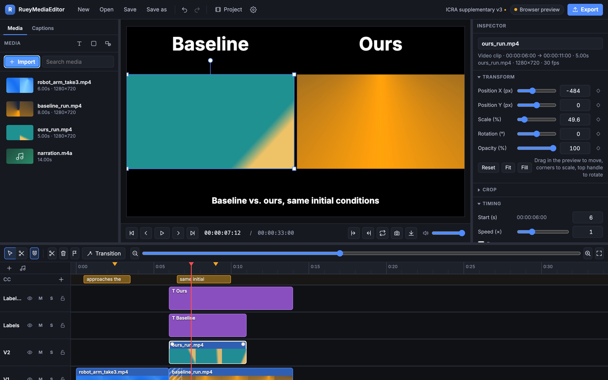

# RueyMediaEditor

A free, open-source desktop video editor. Compiled Rust engine driving native FFmpeg, with a plain HTML/CSS/JavaScript interface in a native window (Tauri). No installer: you clone it, build it, run it.

- **Website (build & run instructions):** the `docs/` folder, served by GitHub Pages
- **Licence:** MIT (FFmpeg itself is LGPL/GPL and runs as a separate program)



---

## Contents

1. [What RueyMediaEditor does](#what-rve-does)
2. [Building and running](#building-and-running)
3. [Using the editor](#using-the-editor)
4. [Architecture](#architecture)
5. [How an export works](#how-an-export-works)
6. [Project file format](#project-file-format)
7. [Hacking guide](#hacking-guide)
8. [Testing](#testing)
9. [Known limits and ideas](#known-limits-and-ideas)

---

## What RueyMediaEditor does

| Area | Features |
| --- | --- |
| Timeline | Unlimited video and audio tracks; drag to move (across tracks), trim handles, razor tool, split at playhead, ripple delete, duplicate, copy/paste, marquee selection, snapping to clip edges/playhead/markers, markers, in/out points, zoom, undo/redo with labelled steps |
| Transform | Position, scale, rotation, opacity per clip. Drag, resize and rotate directly on the preview. Crop. Fit / fill |
| Keyframes | Every transform property and clip volume can be keyframed. Linear or eased interpolation. Keyframes move with trims and split correctly |
| Speed | 0.1× to 16× per clip, audio stays in pitch (`atempo`). Reverse playback |
| Transitions | Cross dissolve, fade through black/white, wipes, slides, circle open/close, radial, zoom, pixelize, blur, noise dissolve, squeeze, diagonal. Any of FFmpeg's `xfade` transitions is one line to add |
| Titles | Text clips: size, weight, colour, alignment, background box, padding, shadow, line height. Bundled Inter font or any .ttf/.otf you pick, identical in preview and export |
| Captions | Caption track with its own lane on the timeline. Type them, import/export SRT (VTT import too), or transcribe a clip locally with whisper.cpp. Styled and burned in on export |
| Annotations | Rectangle, ellipse, arrow and line clips with stroke, fill and size; move, scale and rotate them on the preview. Timecode overlays (HH:MM:SS.mmm or frame number, timeline or clip time) |
| Researcher tools | Split-screen layouts (side by side, three across, top/bottom, 2×2, picture in picture), "Compare with labels" (Baseline · Ours · Ground truth), sync two clips by audio, freeze frame, remove silence, watermark/logo helper, export the current frame as PNG/JPEG |
| Colour clips | Solid colour backgrounds |
| Effects | Colour correction (brightness, contrast, saturation, gamma, hue, exposure, colour temperature), blur, sharpen, flip, black & white, sepia, invert, vignette, chroma key, 3D LUT (.cube), film grain. One-click looks (warm, cool, cinematic, vivid, faded, noir…). Stackable and reorderable |
| Audio | Volume, fade in/out (drag handles on the clip), mute, per-track mute/solo, detach audio from video, master preview volume |
| Media | Anything FFmpeg can read. Thumbnail filmstrips, waveforms, automatic proxies for files the webview can't decode (or for everything above 1080p, configurable) |
| Preview | Real-time canvas compositor with an "Accurate frame" button that renders the current frame through FFmpeg for pixel-exact results |
| Export | H.264, HEVC, VP9, AV1, ProRes, GIF, audio-only (AAC, MP3, Opus, WAV, FLAC). Constant quality, bitrate, or a target file size. Venue presets (ICRA/IROS, RSS, CVPR, NeurIPS, CoRL, social) that warn about length and size limits. Hardware encoders (Apple VideoToolbox, NVIDIA NVENC, Intel Quick Sync, AMD AMF) when available. Any resolution (16:9, 9:16, 1:1, 4:3, 21:9, custom) and frame rate. In/out range export. Progress with ETA, cancel, and "show me the ffmpeg command" |
| Projects | `.rve` JSON files. Autosave recovery copy every minute |
| App | Dark and light theme, keyboard shortcuts, FFmpeg auto-download, cache management |

## Building and running

Prerequisites: [Rust](https://rustup.rs) and the [Tauri prerequisites](https://tauri.app/start/prerequisites/) for your OS.

```sh
cargo install tauri-cli --version "^2"      # once
git clone https://github.com/rueyday/RueyMediaEditor.git rve
cd RueyMediaEditor
cargo tauri dev                              # run a development build
cargo tauri build                            # or produce a bundle in src-tauri/target/release/bundle/
```

The first build compiles all dependencies and takes a few minutes. After that, UI edits are visible on reload and engine edits rebuild in seconds.

**FFmpeg.** RueyMediaEditor needs `ffmpeg` and `ffprobe`. It looks, in order, in: a folder you pick in Settings → FFmpeg; next to the RueyMediaEditor executable (put sidecars in `src-tauri/binaries/`, see the README there); a copy it downloaded itself into the app data folder; your PATH (plus the usual Homebrew and Linux locations). If nothing is found, the app offers a one-click download of static builds from [ffmpeg-static](https://github.com/eugeneware/ffmpeg-static).

**Working on the UI without compiling.** Open `ui/index.html` through any static server (for example `python3 -m http.server -d ui 8000`). A mock engine kicks in: you can import files, edit, and see the whole interface. Export and proxies need the real app.

## Using the editor

1. **Import** media with the Import button, ⌘I, or by dropping files anywhere. The first import on an empty timeline is placed automatically.
2. **Arrange** clips on the timeline: drag to move, drag the edges to trim, `S` to split at the playhead, `C` for the razor tool, `Delete` to remove (`Shift+Delete` ripples). Drag a video clip up to another video track to layer it.
3. **Transform** the selected clip by dragging it on the preview (corners scale, the top handle rotates) or with the Inspector sliders. Click the diamond next to a property to set a keyframe at the playhead; move the playhead, change the value, and it keyframes automatically.
4. **Transitions**: select a clip and choose an In transition in the Inspector (or right-click → Add transition). If the clip touches the previous one, the two blend; otherwise it fades in from transparent.
5. **Titles and colours**: the T and square buttons in the media panel add clips at the playhead.
6. **Audio**: drag the round handles at the top corners of a clip to fade; the Inspector has volume, mute and Detach audio.
7. **Export** with ⌘E. Pick a preset or dial in codec, quality, resolution and frame rate. Set in/out points (`I`, `O`) to export a range.

Shortcuts: Space play/pause · J/K/L · ←/→ frame step (Shift: 1 s) · ↑/↓ previous/next edit · Home/End · S split · C razor · V select · N snapping · M marker · I/O in/out · R reverse · F freeze frame · ⇧C add caption · ⌘Z/⌘⇧Z undo/redo · ⌘C/X/V · ⌘D duplicate · ⌘S save · ⌘O open · ⌘N new · ⌘E export · +/− zoom · ⇧Z zoom to fit · , and . nudge one frame.

**Researcher workflows.** Put each experiment video on its own track, select them all, and pick a layout in the Inspector (or right-click → Layout). "Compare with labels…" adds a title above each cell. "Sync by audio" lines up two recordings of the same event. Add a timecode overlay to show frame numbers, annotate with arrows and boxes, freeze a frame to talk over it, and export with a venue preset that keeps the file under the size limit.

**Captions.** The Captions tab (left panel) lists every caption; ⇧C adds one at the playhead. Import SRT/VTT or export SRT for upload. For automatic captions install [whisper.cpp](https://github.com/ggml-org/whisper.cpp) (`brew install whisper-cpp` on macOS), download a `ggml-*.bin` model, set both paths in Settings → Captions, select a clip and press Auto. Everything runs locally.

## Architecture

```
ui/                      Front end. No framework, no bundler. Tauri serves it as static files.
  index.html             Layout skeleton
  css/app.css            Theme and components (CSS variables; dark/light)
  js/main.js             Bootstrap, top bar, project open/save/autosave
  js/state.js            state object, event bus, undo/redo (JSON snapshots)
  js/model.js            Project model, keyframe interpolation, transitions, effect definitions
  js/ops.js              Editing operations (split, delete, paste, transitions, tracks…)
  js/timeline.js         Timeline rendering and pointer interactions
  js/preview.js          Canvas compositor, playback clock, Web Audio mixer, on-canvas transform gizmo
  js/inspector.js        Property panel
  js/media.js            Media bin, importing, proxies, drag to timeline
  js/captions.js         Captions panel: manual, SRT import/export, whisper.cpp
  js/export.js           Export dialog and progress
  js/settings.js         Settings, FFmpeg setup, project settings
  js/shortcuts.js        Keyboard map
  js/bridge.js           invoke()/listen()/dialogs; falls back to js/mock.js in a browser
  fonts/                 Inter (OFL)

src-tauri/               Engine (Rust).
  src/lib.rs             Tauri app setup, command registration
  src/commands.rs        The API the UI calls: probe, assets, proxies, export, frame render, files
  src/ffmpeg.rs          Finding, downloading and running FFmpeg with progress parsing
  src/probe.rs           ffprobe JSON → MediaInfo
  src/thumbs.rs          Filmstrips, waveforms, proxies
  src/tools.rs           Freeze-frame extraction, silence detection, audio sync, whisper.cpp transcription
  src/project.rs         Project model (serde), mirrors ui/js/model.js
  src/export.rs          Project → ffmpeg filter graph and command line
  tests/                 Integration test that runs a real export

docs/                    The website (GitHub Pages: Settings → Pages → Deploy from branch → /docs)
```

**Division of labour.** The UI owns the project (it is the source of truth and holds the undo history). The engine is stateless except for running processes: every command receives what it needs. For export, the UI sends the entire project JSON; Rust builds one FFmpeg invocation and streams progress back as events. The preview is a separate, approximate renderer written for interactivity; the "Accurate frame" button asks Rust to render a single frame with the real graph, so anything the canvas can't do (chroma key, LUTs, sharpen, fancy transitions) can still be checked before exporting.

**Why a web UI in a native window?** The engine is where speed matters, and it is compiled Rust calling native FFmpeg. The interface is DOM and canvas, which are fast enough for a timeline and are far easier to change: no build step, and an edit-and-reload loop. Tauri's WebView is the system one (WebKit on macOS, WebView2 on Windows, WebKitGTK on Linux), so binaries stay small.

## How an export works

`src-tauri/src/export.rs` turns a project into a single `ffmpeg` command using `-filter_complex_script`. The design:

1. **Inputs.** Each clip becomes its own input with `-ss <in> -t <len>` before `-i`, so FFmpeg seeks instead of decoding from the start. Images use `-loop 1`.
2. **Layers.** Every visual clip becomes a full-frame RGBA layer of exactly its timeline length: `setpts` (speed) → `fps` → `crop` → effects → `format=rgba` → `scale` (fit + user scale, keyframe expressions with `eval=frame`) → `rotate` → opacity (`colorchannelmixer`, or `geq` when keyframed) → fades → `tpad` + `trim` (exact length) → `overlay` onto a transparent canvas at the (keyframed) position. Titles are `drawtext` on a transparent frame with the bundled font; colour clips are `color` sources.
3. **Tracks.** Each video track becomes one continuous stream: transparent `color` fillers for gaps, `concat` between clips, and `xfade` where a clip has an In transition and touches the previous clip (the previous layer is extended by the transition length so both sides have frames).
4. **Stacking.** Tracks are overlaid bottom to top onto a black base with `overlay=eof_action=pass`.
5. **Audio.** Each audible clip: `aformat` → `atempo` chain (speed) → `atrim` → `volume` → `afade` → `adelay` to its timeline position. All are mixed with `amix=normalize=0`, padded and trimmed to the timeline length. Track mute/solo and clip mute are honoured.
6. **Captions and output.** Captions are `drawtext` filters with `enable='between(t,start,end)'` on the composited frame. Then optional in/out `trim`, optional resize, pixel format, codec arguments chosen per encoder (CRF for x264/x265/VP9/AV1, bitrate for hardware encoders, palette generation for GIF).

Shapes are rasterised by the UI (the same canvas code that previews them) into PNGs at project resolution and composited like images, so ffmpeg never needs a vector renderer. Reversed clips use `reverse`/`areverse` on exactly the trimmed source range. Timecode overlays are `drawtext` with `%{pts:hms:offset}` or `%{eif:n+offset:d}`.

Keyframes become nested `if(lt(t,…),…)` expressions (`kf_expr`), identical in meaning to the JavaScript interpolation in `model.js`. The full command and filter graph are written to `export.log` and `graph.txt` in the cache folder, and the export dialog can show and copy them, so you can reproduce or tweak any render by hand.

## Project file format

A `.rve` file is JSON:

```jsonc
{
  "version": 1,
  "name": "My film",
  "settings": { "width": 1920, "height": 1080, "fps": 30, "sample_rate": 48000 },
  "media": { "<id>": { "path": "/abs/path.mp4", "name": "path.mp4", "kind": "video", "duration": 12.3,
                       "width": 1920, "height": 1080, "fps": 29.97, "has_video": true, "has_audio": true } },
  "tracks": [            // top of the UI first; video tracks render bottom-up
    { "id": "…", "kind": "video", "name": "V1", "muted": false, "solo": false, "hidden": false, "locked": false,
      "clips": [ {
        "id": "…", "kind": "video",          // video | audio | image | title | color
        "media_id": "<id>", "start": 0, "in": 1.5, "out": 6.0, "speed": 1,
        "volume": 1, "muted": false, "audio_detached": false, "fade_in": 0, "fade_out": 0.5,
        "transform": { "x": 0, "y": 0, "scale": 1, "rotation": 0, "opacity": 1 },
        "keyframes": { "x": [ { "t": 0, "v": -200, "ease": "ease" }, { "t": 2, "v": 0, "ease": "linear" } ] },
        "crop": { "left": 0, "top": 0, "right": 0, "bottom": 0 },
        "effects": [ { "type": "color", "params": { "saturation": 1.2 }, "enabled": true } ],
        "transition_in": { "type": "wipeleft", "duration": 1 },
        "transition_out": null,
        "title": null, "color": null, "name": ""
      } ] }
  ],
  "markers": [ { "t": 4.0, "label": "chorus", "color": "#f5a524" } ]
}
```

Times are seconds. `in`/`out` are source times; a clip's timeline length is `(out - in) / speed`. Keyframe times are relative to the clip start on the timeline. Media paths are absolute; if a file moves, re-import it.

## Hacking guide

- **Add an effect.** Add its definition to `EFFECTS` in `ui/js/model.js` (name, parameters, whether the canvas can preview it and, if so, its CSS filter in `cssFilter`). Add a match arm in `effect_filters` in `src-tauri/src/export.rs` producing the FFmpeg filter string. Done: the inspector, the badge, and the export pick it up.
- **Add a transition.** Append an entry to `TRANSITIONS` in `model.js` using an [xfade transition name](https://trac.ffmpeg.org/wiki/Xfade). Optionally add a preview approximation in `drawTransition` in `preview.js`.
- **Add an export codec.** Add it to `VIDEO_CODECS`/`PRESETS` in `ui/js/export.js` and an arm in `video_codec_args` in `export.rs`.
- **Add a command.** Write a `#[tauri::command(async)]` function in `commands.rs`, register it in `lib.rs`, call it with `invoke('name', { args })` from the UI. Long jobs emit progress with `app.emit`.
- **Change the look.** Everything is CSS variables at the top of `ui/css/app.css`.
- **Debug an export.** Export → "Show ffmpeg command", or open the cache folder from Settings → Cache and read `export/export.log` and `export/graph.txt`.

## Testing

```sh
cd src-tauri
cargo test                                          # unit tests: probe parsing, keyframe expressions, graph building
RVE_FFMPEG_DIR=/path/with/ffmpeg cargo test --test export_integration   # real export through ffmpeg, checks pixels
```

The UI has no build step; open it in a browser with the mock engine to exercise it by hand.

## Known limits and ideas

- Export is a single FFmpeg process. Very long timelines with many layers use a lot of memory; render in ranges if you hit limits.
- Keyframed opacity uses `geq`, which is slow on big frames. Constant opacity is fast.
- The preview approximates some transitions (radial, zoom, pixelize, …) as cross dissolves and cannot show chroma key, LUTs, sharpen or grain. "Accurate frame" renders them exactly.
- Range export decodes from the beginning of each involved clip; it is correct but not as fast as it could be.
- Reversed clips play as stepped frames in the preview (media elements cannot play backwards); the export is smooth. Long reversed clips use memory proportional to their length.
- Not yet: nested sequences, audio effects beyond volume/fade, speed ramps, text animation presets, motion tracking, stabilisation, AI background removal. All are additive to the current design (see Hacking guide).
